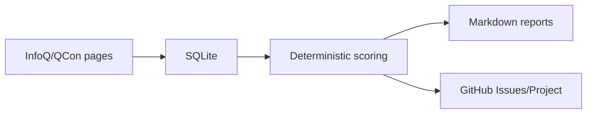
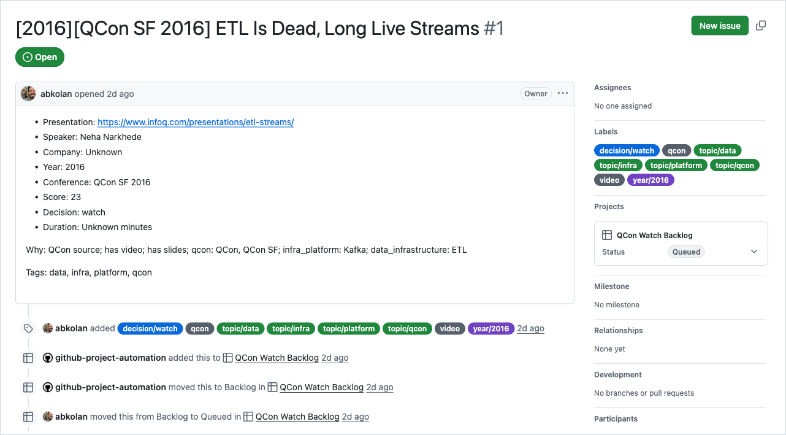
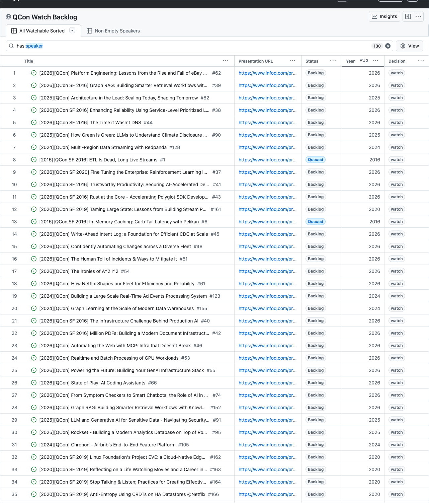

# weekly-qcon-watchlist

A curated QCon/InfoQ video backlog for learning from strong engineering talks without drowning in conference archives.

QCon and InfoQ have years of valuable talks on distributed systems, infrastructure, data platforms, reliability, architecture, engineering leadership, and newer AI/ML infrastructure work. The problem is not scarcity. The problem is deciding what is worth watching next, remembering what has already been queued, and keeping the backlog fresh without manually revisiting old conference pages.

This repo automates that curation loop.



The project is intentionally small. SQLite is the source of truth, scoring is configured in `watchlist.toml`, and GitHub Issues plus the GitHub Project are generated views over that state.

## Table Of Contents

- [What It Optimizes For](#what-it-optimizes-for)
- [Current State](#current-state)
- [Screenshots](#screenshots)
- [Dashboard](#dashboard)
- [Quick Start](#quick-start)
- [Common Workflows](#common-workflows)
- [Configuration](#configuration)
- [How To Update Keywords](#how-to-update-keywords)
- [Data Strategy](#data-strategy)
- [GitHub Setup](#github-setup)
- [GitHub Actions](#github-actions)
- [Database Maintenance](#database-maintenance)
- [Project Layout](#project-layout)
- [Design Constraints](#design-constraints)

## What It Optimizes For

The scoring is intentionally biased toward high-signal engineering talks with durable value. Distributed systems is a first-class topic.

It especially looks for:

- distributed systems, distributed architecture, and production system design
- production case studies and reliability lessons
- platform engineering and internal developer platforms
- infrastructure, SRE, DevOps, and observability
- databases, storage, streaming, and data infrastructure
- data engineering, pipelines, lakehouse, and warehouse topics
- AI infrastructure, MLOps, LLMOps, model serving, evals, and data governance
- architecture and engineering leadership talks with concrete operating lessons

It intentionally de-emphasizes:

- generic beginner introductions
- vendor-heavy product demos
- vague transformation or process talks
- hype-heavy titles without operational substance

The objective is not complete archival coverage. The objective is a practical watch backlog: talks with enough signal to watch, skim, or read via transcript.

## Current State

This is a working local-first automation system:

- Python 3.12 CLI
- QCon/InfoQ crawling and parsing
- polite HTTP fetching with local HTML cache files
- SQLite migrations and storage helpers
- deterministic scoring from editable TOML config
- historical and weekly Markdown report rendering
- GitHub Issue sync through `gh`
- GitHub Project sync through `gh`
- CI workflow
- manual historical backfill workflow
- weekly scheduled workflow
- pytest coverage for parser, crawler, storage, scoring, reports, workflows, and GitHub sync behavior

`data/infoq.db` is intentionally tracked. It keeps durable crawl and GitHub sync state so repeated local or CI runs do not recreate already-synced issues.

The first real sync created:

- [#1 ETL Is Dead, Long Live Streams](https://github.com/abkolan/weekly-qcon-watchlist/issues/1)

## Screenshots

Screenshots should be added after the backlog has enough real data to show the intended workflow clearly.

Planned README screenshots:

- Sample generated GitHub issue for one synced talk.
- GitHub Project board showing the backlog and CLI-managed fields.

Recommended file locations:

```text
docs/screenshots/sample-issue.png
docs/screenshots/project-board.png
```

When those screenshots exist, attach them here with normal Markdown image links:

```markdown


```

## Dashboard

The GitHub Project is the watch board:

```text
QCon Watch Backlog
```

Status columns:

- `Backlog`: synced from the CLI, not yet selected
- `Queued`: actively planned for near-term watching
- `Watching`: currently in progress
- `Watched`: completed
- `Skipped`: intentionally not watching
- `Rewatch`: worth revisiting later

Project fields populated by the CLI:

- `Status`
- `Year`
- `Decision`
- `Score`
- `Speaker`
- `Conference`
- `Presentation URL`

New synced issues land in `Backlog`.

## Quick Start

Install dependencies:

```bash
uv sync --extra dev
```

Run tests:

```bash
uv run --extra dev pytest -q
```

Apply database migrations:

```bash
uv run infoq-watchlist migrate
```

Preview the next eligible 2016 GitHub issues without writing to GitHub:

```bash
uv run infoq-watchlist github-sync --year 2016 --limit 5 --dry-run
```

Create a small issue batch and add the issues to the configured Project:

```bash
uv run infoq-watchlist github-sync \
  --year 2016 \
  --limit 5 \
  --create-issues \
  --add-to-project
```

## Common Workflows

### Crawl And Score

Fetch configured sources, enrich talks from presentation detail pages, and write scored rows to SQLite:

```bash
uv run infoq-watchlist crawl \
  --start-year 2016 \
  --end-year 2016 \
  --max-pages 1 \
  --enrich-details
```

After changing `watchlist.toml`, rescore existing rows without crawling again:

```bash
uv run infoq-watchlist score
```

### Render Reports

Create a historical Markdown watchlist:

```bash
uv run infoq-watchlist report \
  --start-year 2016 \
  --end-year 2026 \
  --top-per-year 15
```

Create a compact weekly report:

```bash
uv run infoq-watchlist weekly --days 14 --top 10
```

Create a review batch that can be pasted into a GitHub issue:

```bash
uv run infoq-watchlist issue-batch \
  --title "InfoQ/QCon Historical Batch" \
  --top 20
```

Export all stored rows to CSV:

```bash
uv run infoq-watchlist export-csv
```

### Sync To GitHub

Dry-run sync for one year:

```bash
uv run infoq-watchlist github-sync --year 2016 --limit 25 --dry-run
```

Create GitHub issues and add them to the configured Project:

```bash
uv run infoq-watchlist github-sync \
  --year 2016 \
  --limit 25 \
  --create-issues \
  --add-to-project
```

Sync recently published talks:

```bash
uv run infoq-watchlist github-sync \
  --recent-days 14 \
  --limit 25 \
  --create-issues \
  --add-to-project
```

The sync command is idempotent:

- talks with an existing `github_issue_number` are skipped
- created issue identifiers are recorded immediately
- `--dry-run` performs no GitHub writes
- rate-limit failures stop the run cleanly instead of continuing blindly

## Configuration

Runtime behavior is controlled by `watchlist.toml`.

Important sections:

- `[sources]`: seed InfoQ/QCon URLs to crawl
- `[thresholds]`: score cutoffs for `watch`, `skim`, `transcript`, and lower-priority decisions
- `[metadata_weights]`: bonuses for useful metadata such as QCon source, transcript, slides, and company fit
- `[popularity]`: optional score bonus from likes and views
- `[[signals]]`: weighted text matches that add tags and score changes
- `[companies]`: preferred company names for scoring
- `[github]`: repository, Project, eligible decisions, batch size, and write delay

The default eligible GitHub decisions are:

```toml
eligible_decisions = ["watch", "skim", "transcript"]
```

Rows scored as `background` or `skip` remain in SQLite but are not synced unless the config changes later and the rows are rescored.

## How To Update Keywords

Keyword matching lives in `watchlist.toml` under repeated `[[signals]]` blocks. Edit this file when you want to change which talks are promoted, demoted, or tagged.

Each signal has four fields:

```toml
[[signals]]
name = "data_infrastructure"
weight = 4
tags = ["data"]
terms = [
  "data platform",
  "data pipeline",
  "stream processing",
]
```

Field meanings:

- `name`: stable internal name used in the generated `Why:` explanation.
- `weight`: score change applied when any term in the signal matches.
- `tags`: labels added to matched talks and later used in reports/issues.
- `terms`: words or phrases to search for in talk metadata.

Matching behavior is intentionally simple:

- Terms are matched case-insensitively.
- Terms are matched against title, summary, speaker, company, source, conference, track, and topics.
- A signal adds its `weight` once per talk, even if several terms in that signal match.
- The generated reason shows up to the first three matching terms for that signal.
- Positive weights promote talks; negative weights demote talks.

To add a new keyword to an existing category:

1. Open `watchlist.toml`.
2. Find the relevant `[[signals]]` block.
3. Add the phrase to that block's `terms` list.
4. Run `uv run infoq-watchlist score` to rescore existing rows.
5. Run `uv run infoq-watchlist report --start-year 2016 --end-year 2026` to inspect the result.
6. Run `uv run infoq-watchlist github-sync --year 2016 --limit 25 --dry-run` before creating any GitHub issues.

Example, to make `control plane` count as infrastructure:

```toml
[[signals]]
name = "infra_platform"
weight = 4
tags = ["infra", "platform"]
terms = [
  "distributed systems",
  "Kubernetes",
  "control plane",
]
```

To add a new category, create another complete `[[signals]]` block:

```toml
[[signals]]
name = "security_engineering"
weight = 3
tags = ["security"]
terms = [
  "zero trust",
  "supply chain security",
  "secrets management",
]
```

To reduce noisy matches, either remove the term or add a demotion signal with a negative weight:

```toml
[[signals]]
name = "vendor_hype"
weight = -6
tags = ["hype"]
terms = [
  "unlock",
  "revolutionize",
  "next generation",
]
```

After keyword changes, the safe validation loop is:

```bash
uv run infoq-watchlist score
uv run infoq-watchlist report --start-year 2016 --end-year 2026
uv run infoq-watchlist github-sync --year 2016 --limit 25 --dry-run
```

Only run `github-sync` with `--create-issues` after the dry-run output looks right.

## Data Strategy

The canonical database is:

```text
data/infoq.db
```

The database stores compact canonical state:

- InfoQ URL and canonical presentation URL
- title, speaker, company, conference, year, track, and duration
- video, slides, transcript, likes, and views metadata
- score, decision, reason, and tags
- GitHub issue number, issue URL, issue node ID, and Project item ID
- watch status

The database should stay small. It should not store cached HTML, transcripts, media files, or large response bodies.

Generated cache files, reports, CSV exports, and scratch databases are ignored by Git. The tracked SQLite file is the durable sync ledger.

## GitHub Setup

GitHub sync uses the GitHub CLI.

Local setup:

```bash
gh auth refresh -s project
gh auth status
```

GitHub Actions expects this repository secret when Project writes are needed:

```text
QCON_WATCHLIST_TOKEN
```

Use a classic personal access token with:

- `repo`
- `workflow`
- `project`

The built-in `GITHUB_TOKEN` can handle some repository operations, but Project updates require Project access.

## GitHub Actions

### CI

`.github/workflows/ci.yml` runs on push to `main` and on pull requests. It installs dependencies and runs tests only.

### Historical Seed

`.github/workflows/historical-seed.yml` is a manual workflow for controlled historical backfills.

Recommended backfill flow:

1. Run one year with `dry_run=true`.
2. Run the same year with `dry_run=false` and a small `limit`, such as `10` or `25`.
3. Repeat until dry-run returns no eligible rows.
4. Move to the next year.

Avoid backfilling many years in one write run. Smaller batches reduce GitHub rate-limit risk and give the SQLite sync state a chance to commit between runs.

### Weekly Watchlist

`.github/workflows/weekly-watchlist.yml` runs weekly and can also be dispatched manually.

Manual runs default to dry-run. Scheduled runs create eligible issues, update the Project, maintain the SQLite database size, and commit `data/infoq.db` when sync state changes.

## Database Maintenance

Check and compact SQLite when needed:

```bash
uv run infoq-watchlist db-maintenance \
  --vacuum-threshold-mb 5 \
  --fail-threshold-mb 25
```

The command prints JSON with the database size before and after maintenance, runs `VACUUM` when the database crosses the configured threshold, and exits non-zero if the file grows beyond the fail threshold.

## Project Layout

```text
infoq_watchlist/
  cli.py          command-line interface
  crawler.py      HTTP fetching, fixture loading, pagination discovery
  parser.py       InfoQ/QCon listing and detail parsing
  scoring.py      deterministic ranking and tagging
  storage.py      SQLite reads and writes
  migrations.py   migration runner
  github_sync.py  GitHub Issue and Project sync
  report.py       Markdown rendering
  models.py       shared data model

tests/            pytest suite and HTML fixtures
watchlist.toml    editable scoring, source, and GitHub config
SPEC.md           original product spec and design constraints
data/infoq.db     tracked SQLite state
```

## Design Constraints

This project deliberately avoids a web app, browser automation, database servers, and LLM ranking. The implementation should stay easy to run locally, easy to inspect in tests, and safe to automate in small GitHub Actions batches.
